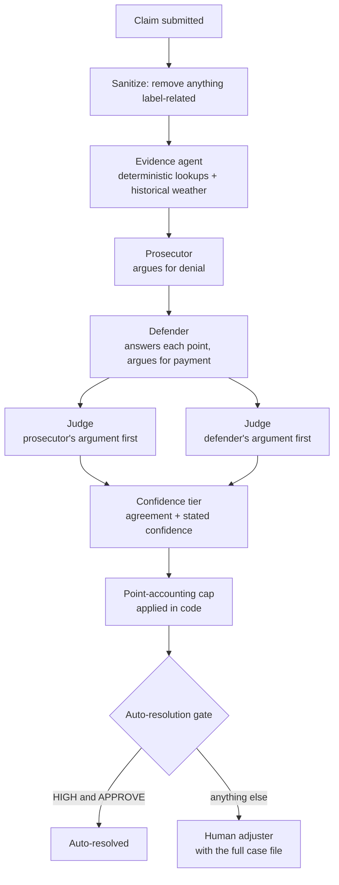

# ClaimLens

**An AI claims-investigation copilot that argues both sides of every claim — and admits when it isn't sure.**

- **Live demo:** https://ai-builders-hackathon.vercel.app
- **API:** https://claimlens-api.onrender.com (interactive docs at `/docs`)
- **Evaluation log:** [`docs/METHODOLOGY.md`](docs/METHODOLOGY.md) — every design decision, pre-registration and correction, written at the time it was made

> The hosted API runs on a free instance that sleeps when idle. If the demo says it can't reach the backend,
> wait about a minute and press **Try again**. See [Known quirks](#known-quirks).

ClaimLens reads an insurance claim, gathers evidence about it, and runs a structured debate: a **Prosecutor** argues the
claim should be denied, a **Defender** answers every point and argues it should be paid, and a **Judge** rules — twice,
with the arguments presented in opposite orders. A confidence tier is then set by fixed rules in code, not by the
model's say-so.

**ClaimLens never denies a claim on its own.** It only auto-resolves claims where it is highly confident *and* the
outcome is a clean approval. Anything uncertain, and every recommendation to deny, goes to a human adjuster with the
full evidence, both sides' arguments and the judge's reasoning attached.

---

## Contents

1. [The problem](#1-the-problem)
2. [What ClaimLens does](#2-what-claimlens-does)
3. [How it works](#3-how-it-works)
4. [The benchmark data](#4-the-benchmark-data)
5. [Evaluation](#5-evaluation)
6. [Known quirks](#known-quirks)
7. [Run it locally](#7-run-it-locally)
8. [Deploy it](#8-deploy-it)
9. [Repository layout](#9-repository-layout)
10. [Limitations and roadmap](#10-limitations-and-roadmap)

---

## 1. The problem

- US insurance fraud losses are estimated at **about $308 billion a year** (2025 estimate: health $68B, workers'
  compensation $34B, auto $29B, general property and casualty about $45B).
  [Hesper AI](https://gethesperai.com/blog/insurance-fraud-statistics-2026/), [Fortunly](https://fortunly.com/statistics/insurance-fraud-statistics/)
- **10–20% of insurance claims contain fraudulent elements**, yet **75% of flagged claims are never fully
  investigated.** This is a capacity problem as much as a detection problem.
  [Hesper AI](https://gethesperai.com/blog/insurance-fraud-statistics-2026/)
- Fraud costs the average US household **$400–$932 a year** in higher premiums.
  [Fortunly](https://fortunly.com/statistics/insurance-fraud-statistics/)
- Only **32% of insurers** use algorithmic fraud-detection tools (up from 10% a decade ago).
  [Fortunly](https://fortunly.com/statistics/insurance-fraud-statistics/)
- Fraud is becoming AI-powered: deepfake fraud attempts are up **2,137%** and AI-enabled document fraud **3,000%**
  since 2023, with AI-generated fakes passing traditional verification **more than 90%** of the time.
  [Hesper AI](https://gethesperai.com/blog/insurance-fraud-statistics-2026/)
- Insurers spend **$5.3 billion a year** fighting fraud and lose **$8.50 for every $1 spent**; AI in investigation could
  save an estimated **$80–160 billion cumulatively by 2032**.
  [Hesper AI](https://gethesperai.com/blog/insurance-fraud-statistics-2026/)

A tool that simply says "fraud" or "not fraud" with false confidence does not help an overloaded adjuster — and in a
regulated industry, a wrongly denied claim is real harm. ClaimLens is built around the opposite idea: surface the
evidence, show both sides, and be explicit about how sure the system is.

## 2. What ClaimLens does

| Screen | What it shows |
|---|---|
| **Intake** | Submit a claim by hand, or load a stored sample and see its finished result. Live submission shows step-by-step progress. |
| **Dashboard** | The case queue, filterable by status, confidence tier and outcome, with a badge wherever the confidence cap fired. |
| **Case view** | Readable evidence; the Prosecutor's and Defender's arguments side by side; both Judge rulings side by side; a point-by-point table of how every argument was answered; a confidence gauge; and, when it applies, a plain-language explanation of why confidence was capped. |
| **Analytics** | The evaluation results for the pre-registered sample, as raw counts, with the sample size, the pre-registration and an "always approve" reference line on the page itself. |

## 3. How it works



### The pieces

| Step | What happens | Model calls |
|---|---|---|
| **Evidence agent** | Builds a neutral case file: timeline, policy changes, prior claims across insurers, location checks, documents the description calls for but that are missing, and **real historical weather** for the incident date and place from the [Open-Meteo](https://open-meteo.com/) archive. It states facts, never conclusions. | 0 |
| **Prosecutor** | Makes the strongest honest case for denial, citing case-file facts. | 1 |
| **Defender** | Answers every Prosecutor point by id — rebutting it with facts or conceding it — then adds its own points. | 1 |
| **Judge × 2** | Rules on the same arguments twice, in opposite orders. Each ruling gives a decision, reasoning, a HIGH / MEDIUM / LOW confidence with a justification, and an assessment of how every point was answered. | 2 |
| **Calibration and gate** | Combines the two rulings into a tier, applies the point-accounting cap, and decides whether the claim may resolve without a human. | 0 |

All model calls use **`openai/gpt-oss-120b` on Groq**, temperature **0.2**, reasoning effort **medium**, with JSON
output, through one shared client that retries rate limits and logs every request and response.

### Why an adversarial debate

Judging whether a claim is fraudulent is hard to verify directly; checking whether a specific argument is supported by
the evidence is much easier. That asymmetry is the core idea of **Irving, Christiano & Amodei, "AI Safety via Debate"
(2018)** ([arXiv](https://arxiv.org/abs/1805.00899), [OpenAI](https://openai.com/index/debate/)): two agents argue
opposite sides and a judge decides, because it is easier to verify a winning argument than a hard claim. ClaimLens
applies this directly — each side must cite case-file facts, and the Judge is instructed to check every citation and to
treat "that is permitted / normal" as no answer to a point about the particular facts of the claim.

### Why calibration, and why it is done in code

A recommendation is only useful to an adjuster if its confidence means something.

1. **Order-swap consistency check.** Language-model judges are sensitive to the order in which arguments are presented.
   ClaimLens asks the Judge twice, once with each argument first. A decision that changes when only the order changes
   is not one to act on. This follows the research line on verbalized confidence cross-checked by consistency
   ([On Verbalized Confidence Scores](https://arxiv.org/html/2412.14737v2),
   [Two Samples Are Enough](https://openreview.net/forum?id=66D3rZrNjV)).
2. **Confidence tier**, from the two rulings:
   - **HIGH** — both orderings reach the same decision and both say HIGH;
   - **MEDIUM** — both reach the same decision, but at least one is less than HIGH;
   - **LOW** — the orderings reach different decisions.
3. **Point-accounting cap.** Each Judge ruling labels every numbered point as *answered with a case-file fact*,
   *answered by assertion only*, *conceded* or *unanswered*. **In code**, a HIGH tier is lowered to MEDIUM if any point
   against the decision was conceded, answered only by assertion or left unanswered while significant, or was not
   assessed at all. The Judge is not told this rule exists. During development, asking the model to be stricter with
   itself did not work — both Judge rulings kept giving HIGH to arguments they had themselves marked as unanswered —
   so the consequence is applied mechanically.
4. **Auto-resolution gate.** Only a **HIGH-tier APPROVE** resolves without a human. Every DENY and every MEDIUM or LOW
   case goes to an adjuster.

### Safeguards against fooling ourselves

- **Labels never reach a model.** Every claim passes through one `sanitize_claim()` function; tests run over all 40
  claims to prove no label, difficulty tag or designed-signal name appears in anything sent to a model.
- **A fair baseline.** The comparison system is a single model call given the *same* sanitized claim, the *same*
  evidence object, the *same* model and settings, and a carefully written prompt that asks for calibrated confidence.
  The only difference from ClaimLens is the architecture.
- **Every model call is logged** (request, raw response, token counts, timestamp) in `backend/data/llm_logs/`.

## 4. The benchmark data

The project uses **40 synthetic insurance claims** (auto and property), generated deterministically from a fixed seed
(`backend/app/synthetic/generate_claims.py`, seed 42). No real policyholder data is involved.

> **The fraud rate is deliberately high: 16 of 40 claims (40%) are fraud.** Real-world estimates are 10–20%. At those
> rates a 40-claim set would contain only 4–8 fraud claims — too few to measure whether a system catches fraud or how
> often it is confidently wrong. Fraud is therefore oversampled to give the evaluation statistical signal. The practical
> consequence: a system that approves everything is right on 24 of 40 claims (60%), and on **10 of 15** in the
> evaluation sample. Every accuracy figure is shown next to that reference line.

- **Difficulty:** 14 easy, 14 ambiguous, 12 hard.
- **Designed fraud signals** (22 across the 16 fraud claims, nine kinds): a claim made soon after the policy started, a
  coverage upgrade shortly before the loss, an incident location that does not fit the story, a near-duplicate of an
  earlier claim, damage out of proportion to the described incident, an amount above the vehicle's value, missing
  documents, inconsistent documents, and weather that contradicts the reported incident (checkable against real
  historical weather).
- **Innocent look-alikes.** Many legitimate claims carry features that look suspicious at first glance — a brand-new
  policy, an incident far from home, prior claims, a large amount — together with documents that explain them. A system
  cannot score well by flagging anything unusual.
- **Solvability check.** `backend/app/synthetic/check_signals.py` (and a test) confirms that every fraud claim still
  contains every signal designed into it, so no case is "fraud with no evidence".
- **Known artefact:** on repair claims whose amount was capped below the vehicle's value, the claimed amount is
  exactly 70% of that value. It occurs on both fraud and legitimate claims.

## 5. Evaluation

The question: **with the same model, the same inputs and the same settings, does the ClaimLens architecture produce
fewer confidently wrong answers than a single-pass baseline?**

Everything below was fixed and committed **before any held-out claim was run**. The full, dated record — including
corrections, disclosures and bugs found along the way — is in [`docs/METHODOLOGY.md`](docs/METHODOLOGY.md).

### Development set and held-out set

- **Development set — 13 claims:** CLM-0001, 0006, 0014, 0019, 0024, 0025, 0027, 0030, 0032, 0033, 0034, 0035, 0036.
  All prompt and design iteration happened on these. Seven were inspected and run during development; six more were
  moved here because they drove data or evidence-rule fixes before the split existed. They are contaminated by
  definition and are never used for headline figures.
- **Held-out set — 27 claims:** every other claim. Not used to change any prompt, rule or setting. Development scripts
  and the API refuse to run them outside the evaluation (`backend/app/synthetic/eval_split.py`).

### The pre-registered sample

Groq's free tier allows about 200,000 tokens a day, and each claim costs roughly 16,000–21,000 tokens across both
systems, so the full 27-claim held-out set could not be evaluated before the deadline. Instead, **15 of the 27 held-out
claims were selected by stratified random sampling and committed before any of them was run** (commit `892f964`).

| | Easy | Ambiguous | Hard | Total |
|---|---|---|---|---|
| **Fraud** | 2 of 4 | 1 of 2 | 2 of 3 | **5 of 9** |
| **Legitimate** | 4 of 6 | 3 of 6 | 3 of 6 | **10 of 18** |

- **Seed:** `20260914` (Python `random.Random`), largest-remainder allocation across the strata above.
- **Claims:** CLM-0004, CLM-0007, CLM-0010, CLM-0011, CLM-0015, CLM-0017, CLM-0020, CLM-0021, CLM-0022, CLM-0026,
  CLM-0028, CLM-0029, CLM-0037, CLM-0039, CLM-0040.
- **SHA-256 of the sorted ID list** (newline-joined): `bbcdf0fd5693fd7a1be43ee4516dd7c99ef71fbb238e696c6c190dc108d5b49a`
- **SHA-256 of the frozen claim data:** `f309786c9be4f527190fd61ef07cdaeb07ea22b6f4a1ccf234b5da968fee8e29`
- **Check it yourself:** `python -m app.synthetic.stage11_sample` (in `backend/`) reproduces the selection from the seed,
  and `tests/test_stage11_sample.py` fails if the selection, the ID hash or the data hash ever changes.

### Decisions fixed in advance

| Decision | Value | Fixed |
|---|---|---|
| Baseline "high confidence" | stated confidence **≥ 80** | Stage 4, before any result was observed |
| Judge "HIGH" | "correct at least 80 times out of 100" — the same number, so both systems' high confidence means the same | Before any debate output |
| ClaimLens "high confidence" | final tier HIGH (after the cap) | Before any held-out run |
| ClaimLens recommendation | the prosecutor-first Judge's decision (the order swap affects confidence only) | Before any held-out run |
| Final configuration | temperature 0.2; no rebuttal round; `conceded` point status | Commit `71e21c8`, before any held-out run |

### Stopping rule

The run is limited by the daily token allowance, so it may not finish before results are reported. It was agreed in
advance that claims are processed strictly in the recorded order (ascending claim ID), and that **if the run is not
finished, the reported set is the first N claims it reached, in that order**, with N and the actual fraud/legitimate
mix disclosed. A claim that fails three times keeps its position and is reported as failed. The reported subset is
never chosen, reordered or trimmed after seeing results, and the batch is never stopped or restarted because of what
interim figures show.

### Reporting rules

With at most 15 claims, results are reported as **raw counts, not percentages**; the **always-approve reference line**
appears next to every accuracy figure; the sample size and pre-registration are stated wherever results appear; and a
difference of one or two claims between systems is described as **directionally suggestive at most**.

### Results

<!-- Filled by scripts/fill_results.py from the final /analytics output. Never type numbers here by hand. -->

These figures cover 15 completed claims (5 fraud, 10 legitimate) from a stratified random sample of 15 of the 27 held-out claims, pre-registered on 2026-09-14 (seed 20260914) before any held-out claim was run. With a sample this small, results are raw counts. All 15 pre-registered claims completed; nothing was truncated.

| Measure | Naive baseline | ClaimLens |
|---|---|---|
| Correct recommendations | 12 of 15 correct (always approve: 10 of 15) | 11 of 15 correct (always approve: 10 of 15) |
| Confidently wrong (baseline: confidence 80 or above; ClaimLens: final tier HIGH) | 1 of 12 high-confidence answers wrong | 0 of 3 high-confidence answers wrong |
| ClaimLens confidently wrong, tier before the cap | — | 2 of 11 high-confidence answers wrong |
| Legitimate claims recommended for denial | 0 of 10 legitimate claims | 0 of 10 legitimate claims |
| Fraud claims recommended for approval | 3 of 5 fraud claims | 4 of 5 fraud claims |
| Fraud dollars caught (claimed amount of fraud claims recommended for denial) | $13,363 of $39,411 | $8,813 of $39,411 |

**How ClaimLens routed the claims.** Auto-resolved without a human: 2 of 15 claims
(fraud among them: 0 of 2). Sent to an adjuster:
13 of 15 claims. Confidence tiers: HIGH 3, MEDIUM 12, LOW 0. The cap lowered HIGH
to MEDIUM on 8 of 15 claims (2 of them with a wrong decision). The two Judge orderings reached different decisions on
0 of 15 claims. Estimated adjuster time saved: 0.7 hours (2 auto-resolved claims at an assumed 22 minutes of manual review each).

**Plain reading.** Correct recommendations on 15 claims: ClaimLens 11, baseline 12, always approve 10. Against always approving, ClaimLens is 1 claim above it, and the baseline is 2 claims above it. ClaimLens has 1 fewer correct recommendation than the baseline: a difference within two claims, so directionally suggestive at most. Confidently wrong answers: ClaimLens 0 of 3 HIGH-tier answers, baseline 1 of 12 answers at confidence 80 or above. ClaimLens has 1 fewer confidently wrong answer than the baseline: a difference within two claims, so directionally suggestive at most. Before the point-accounting cap, ClaimLens had 2 wrong of 11 HIGH-tier answers.

### What these numbers can and cannot show

- **They are small-sample results on synthetic claims.** Fifteen claims can show a direction; they cannot establish a
  rate. The benchmark was written by the same team that built the system, which is why the held-out split,
  pre-registration and published hashes exist.
- **Models vary between runs.** Temperature 0.2 reduces but does not remove run-to-run variation.
- **Development-set history, reported rather than hidden.** On the original 7-claim development set (temperature 1.0,
  before the point-accounting cap existed), both systems were right on 3 of 7 claims and made the same decision on
  every claim. The baseline gave 6 high-confidence answers (3 wrong); ClaimLens gave 3 HIGH tiers (2 wrong), and its
  gate auto-resolved 2 fraud claims. Those failures are why the cap exists. A later re-run on the 13-claim development
  set was cut short by the daily token limit after 1 claim. These figures come from the set the system was tuned on,
  under different settings, and are not comparable with the results above. Full tables are in `docs/METHODOLOGY.md`.
- **Disclosures.** Before the split existed, per-claim listings of all 40 claims (including labels) were printed while
  checking the data, and several sampled claims later appeared with their labels in data-check output. None of them
  drove a change, no model was run on a held-out claim before the evaluation, and the random draw did not take any of
  this into account. Every instance is listed in the methodology log.

### Reproducing the evaluation

The full run needs a Groq API key and roughly 280,000 tokens (over a day on the free tier; it waits and resumes on its
own).

```powershell
cd backend
.\.venv\Scripts\python.exe -u -m app.synthetic.run_full_batch
```

It verifies the sample and data hashes before starting, saves after every model call, and resumes where it stopped.
Results are written to `backend/data/results_naive.json` and `backend/data/results_claimlens.json`, and the figures
above are computed from them by `GET /analytics` (`backend/app/routes/analytics.py`). `scripts/fill_results.py` fills
the result markers in this README from that same computation, applying the reporting rules above, so no figure is
copied by hand.

---

## Known quirks

- **A live submission may not reproduce a results-table row exactly.** The evaluation scripts build each model prompt
  directly from the stored claim. The API first validates a submitted claim through its data schema, which keeps the
  same content but orders fields differently and writes whole numbers as decimals (for example a deductible of `1000`
  becomes `1000.0`). The text the model sees therefore differs slightly — and with sampling at temperature 0.2, outputs
  can differ too. The evaluation results come only from the scripts.
- **The hosted backend sleeps.** The API runs on Render's free instance, which sleeps after about 15 minutes without
  traffic; the first request afterwards can take up to a minute. The site shows "Can't reach the ClaimLens backend"
  with a **Try again** button while it wakes.
- **Live submission is switched off on the public demo.** Each processed claim spends roughly 16,000–19,000 model
  tokens of a shared daily allowance, so the hosted site shows stored results only. Run ClaimLens locally with your own
  Groq key to submit claims live.
- **The stored sample cases are the Stage 11 evaluation results.** The 15 cases you can open on the demo are the
  pre-registered held-out claims, produced by the evaluation run with the final settings. Each case page says how it
  was produced. They are shown only because the run has finished; while a batch is running, none are served.

---

## 7. Run it locally

**Requirements:** Python 3.13 (developed on 3.13.5), Node.js 20.9 or newer (developed on 24), and a free
[Groq API key](https://console.groq.com/keys) — the key is only needed to *process* claims; browsing stored results,
the dashboard, analytics and the test suite work without it.

### Backend (FastAPI) — terminal 1

```powershell
cd backend
python -m venv .venv
.\.venv\Scripts\python.exe -m pip install -r requirements.txt
copy .env.example .env        # then open .env and paste your key after GROQ_API_KEY=
.\.venv\Scripts\python.exe -m uvicorn app.main:app --reload
```

On macOS / Linux use `.venv/bin/python` instead of `.\.venv\Scripts\python.exe`, and `cp` instead of `copy`.
The API runs at <http://localhost:8000> (interactive docs at <http://localhost:8000/docs>).

### Frontend (Next.js) — terminal 2

```powershell
cd frontend
npm install
npm run dev
```

Open <http://localhost:3000>. The frontend forwards `/api/*` to the backend at `http://localhost:8000` by default; set
`BACKEND_URL` to point it elsewhere (see `frontend/.env.example`).

### Tests

```powershell
cd backend
.\.venv\Scripts\python.exe -m pytest tests
```

92 tests, all offline: model calls and weather lookups are replaced with fakes, so they need no API key and spend no
quota. They cover label isolation, the debate and calibration rules, the confidence cap, the batch runner's ordering,
the API, analytics and the pre-registered sample. Frontend checks: `npm run lint` and `npm run build`.

## 8. Deploy it

Frontend on **Vercel**, backend on **Render** using the `render.yaml` Blueprint in this repository. Click-by-click steps,
environment variables and troubleshooting are in [`docs/DEPLOYMENT.md`](docs/DEPLOYMENT.md).

## 9. Repository layout

```
backend/
  app/
    main.py                  FastAPI app (CORS, routes)
    agents/
      sanitize.py            removes labels before anything reaches a model
      evidence_agent.py      deterministic evidence gathering (no model calls)
      case_file.py           the shared input and conventions every model sees
      naive_baseline_agent.py  single-call baseline, pre-registered HIGH threshold
      debate_agent.py        Prosecutor, Defender, Judge
      calibration.py         order swap, confidence tier, point-accounting cap, gate
      llm_client.py          the one Groq client: fixed settings, retries, full logging
    tools/weather_tool.py    Open-Meteo historical weather, cached
    routes/                  claims, samples, analytics and config endpoints
    synthetic/
      generate_claims.py     the 40-claim benchmark (seed 42)
      check_signals.py       confirms every fraud claim still contains its designed signals
      eval_split.py          development / held-out split, enforced
      stage11_sample.py      the pre-registered 15-claim sample
      run_full_batch.py      the evaluation run (checkpointed, resumable)
  data/                      benchmark, sample, results, model-call logs, stored samples
  tests/                     92 offline tests
frontend/
  app/                       intake, dashboard, case view, analytics pages
  components/                debate transcript, judge comparison, point accounting, confidence gauge, ...
docs/
  METHODOLOGY.md             the dated evaluation log
  DEPLOYMENT.md              deployment steps
scripts/
  fill_results.py            fills the result markers in the documents from the final /analytics output
render.yaml                  Render Blueprint for the backend
```

## 10. Limitations and roadmap

- **Synthetic data only.** The next step is evaluation on real, labelled claims under a data-sharing agreement, with
  integrations into insurer claim systems.
- **Small evaluation.** A larger held-out set, repeated runs to measure run-to-run variation, and confidence intervals
  would turn directional findings into measured rates.
- **Trained calibration.** Confidence here comes from prompting and fixed rules. Fine-tuning a model with a reward that
  penalises confident mistakes more than hesitant ones is a stronger approach that was out of scope for this build.
- **Not production software.** No authentication, a single-file SQLite database, and a free model tier with a daily
  token limit.
